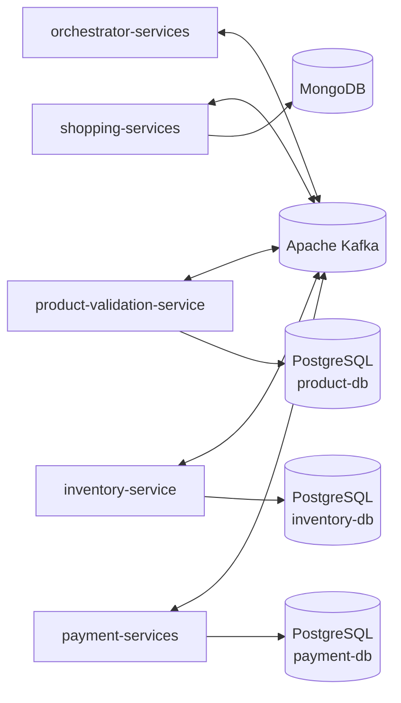

# 🛒 Work Shopping Microservices

Sistema de e-commerce em arquitetura de microsserviços, com **Java 21** e **Micronaut 4**, comunicação assíncrona via **Apache Kafka** e ambiente completo orquestrado com **Docker Compose**.

O projeto foi criado para praticar backend distribuído: separação por domínio, mensageria entre serviços, banco de dados por serviço e observabilidade.

> Frontend: [work-shopping-microservices-frontend](https://github.com/RavikFerreira/work-shopping-microservices-frontend) (React + TypeScript).

---

## 📚 Sumário

- [Visão geral](#-visão-geral)
- [Fluxo de negócio (BPMN)](#️-fluxo-de-negócio-bpmn)
- [Arquitetura](#-arquitetura)
- [Microsserviços](#-microsserviços)
- [Tecnologias](#-tecnologias)
- [Como executar](#️-como-executar)
- [Portas e acessos](#-portas-e-acessos)
- [Observabilidade](#-observabilidade)
- [Melhorias futuras](#-melhorias-futuras)
- [Autor](#-autor)

---

## 📖 Visão geral

A aplicação separa as responsabilidades de um e-commerce em serviços independentes:

- **shopping-services:** pedidos e carrinho de compras.
- **product-validation-service:** validação dos produtos de um pedido.
- **inventory-service:** controle de estoque.
- **payment-services:** processamento de pagamentos.
- **orchestrator-services:** coordenação do fluxo entre os serviços.

Os serviços se comunicam por eventos no Kafka, sem chamadas diretas entre si.

---

## 🗺️ Fluxo de negócio (BPMN)

O processo de negócio foi modelado em BPMN. O arquivo editável é o `processo.bpmn`, na raiz do repositório, e pode ser aberto em [bpmn.io](https://bpmn.io).


---

## 🏗 Arquitetura



**Características:**

- Serviços independentes, cada um com seu próprio container Docker.
- Banco de dados por serviço (PostgreSQL ou MongoDB, conforme o domínio).
- Comunicação assíncrona por eventos via Kafka, com o Redpanda Console para inspecionar tópicos e mensagens.
- Ambiente inteiro definido em um único `docker-compose.yaml`.

---

## 🔧 Microsserviços

| Serviço | Responsabilidade | Banco | Porta |
| --- | --- | --- | --- |
| `shopping-services` | Pedidos e carrinho | MongoDB | 8083 |
| `product-validation-service` | Validação de produtos | PostgreSQL | 8085 |
| `inventory-service` | Estoque | PostgreSQL | 8086 |
| `payment-services` | Pagamentos | PostgreSQL | 8082 |
| `orchestrator-services` | Orquestração do fluxo | n/a | 4000 |

---

## 🚀 Tecnologias

| Categoria | Tecnologias |
| --- | --- |
| Linguagem e frameworks | Java 21, Micronaut 4 |
| Mensageria | Apache Kafka, Redpanda Console |
| Bancos de dados | PostgreSQL 16, MongoDB |
| Cache | Redis |
| Observabilidade | Prometheus, Grafana |
| Infraestrutura | Docker, Docker Compose |
| Documentação da API | Swagger / OpenAPI |

---

## ▶️ Como executar

**Pré-requisitos:** Docker e Docker Compose instalados.

```bash
# 1. Clone o repositório
git clone https://github.com/RavikFerreira/work-shopping-microservices.git

# 2. Entre na pasta
cd work-shopping-microservices

# 3. Suba todo o ambiente (serviços, bancos, Kafka e observabilidade)
docker compose up --build
```

Para derrubar os containers:

```bash
docker compose down
```

---

## 🔌 Portas e acessos

| Componente | Endereço |
| --- | --- |
| shopping-services | http://localhost:8083 |
| payment-services | http://localhost:8082 |
| product-validation-service | http://localhost:8085 |
| inventory-service | http://localhost:8086 |
| orchestrator-services | http://localhost:4000 |
| Redpanda Console (Kafka) | http://localhost:8000 |
| Prometheus | http://localhost:9090 |
| Grafana | http://localhost:3000 |

---

## 📊 Observabilidade

O Prometheus é configurado em `config/prometheus.yml` e o Grafana sobe junto no Docker Compose, na porta 3000, para visualização das métricas.

---

## 📈 Melhorias futuras

- Testes automatizados (unitários e de integração).
- Pipeline de CI/CD com GitHub Actions.
- Dashboards do Grafana versionados no repositório.
- Tracing distribuído.
- Variáveis sensíveis fora do `docker-compose.yaml` (arquivo `.env`).
- Deploy em cloud.

---

## 👨‍💻 Autor

Desenvolvido por **José Ravik Ferreira de Moraes**.

- GitHub: [RavikFerreira](https://github.com/RavikFerreira)
- LinkedIn: [ravikferreira](https://www.linkedin.com/in/ravikferreira/)
